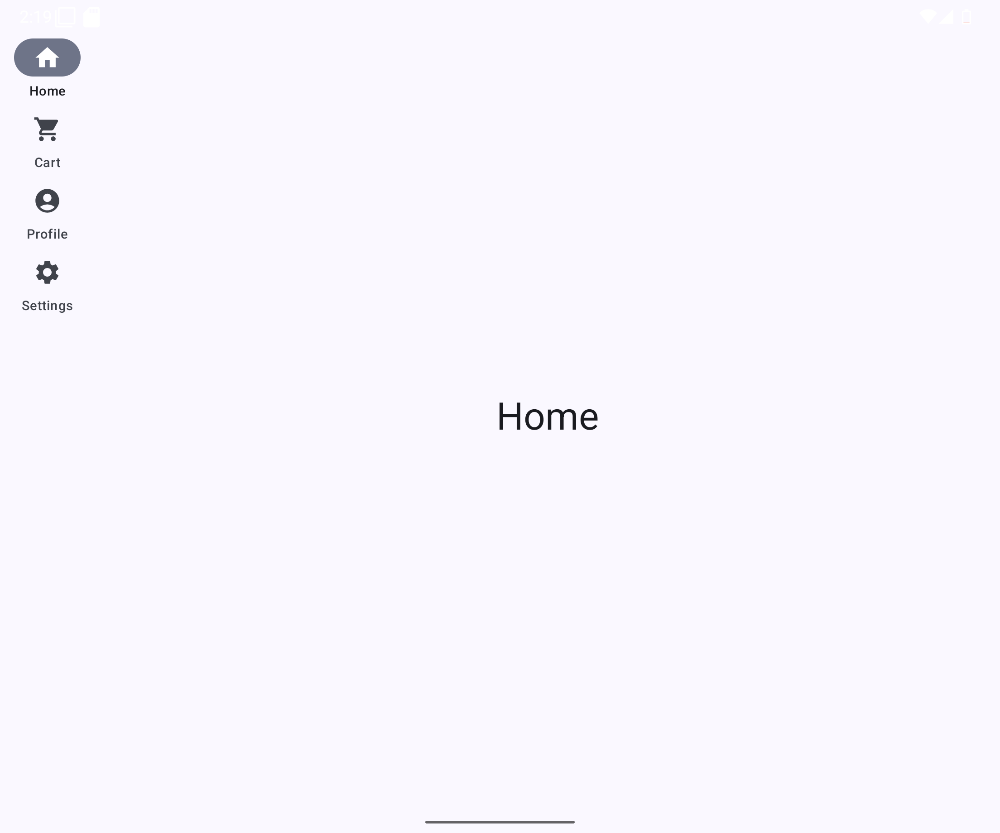

# Adaptive Layout in Compose for Android Apps





This project demonstrates how to use [Adaptive Layout](https://developer.android.com/jetpack/compose/layouts/adaptive) in your Android application.

Adaptive Layout allows you to create layouts that adapt to different screen sizes and orientations.


To use Adaptive Layout in your app, you need to add the following dependencies to your build.gradle file:

```kotlin
 dependencies{
    implementation ("androidx.compose.material3.adaptive:adaptive-layout:1.1.0-alpha07")
    implementation ("androidx.compose.material3.adaptive:adaptive-navigation:1.1.0-alpha07")
    // navigation suite
    implementation ("androidx.compose.material3:material3-adaptive-navigation-suite:1.3.1")

}
```


To Create a App Routes

```kotlin
 enum class AppRoutes(val route: String,val icon: ImageVector) {
     Home("Home", Icons.Filled.Home),
     About("About", Icons.Filled.Info),
     Settings("Settings", Icons.Filled.Settings),
     Contact("Contact", Icons.Filled.Phone),
     
 }
```


To Create a NavigationSuiteScaffold

```kotlin

setContent {
    LearnAdaptiveLayoutTheme {

        var navController by remember {
            mutableStateOf(AppRoutes.Home)
        }

        val windowSize = with(LocalDensity.current) {
            currentWindowSize().toSize().toDpSize()
        }

        val layoutType = if (windowSize.width >= 1000.dp) {
            NavigationSuiteType.NavigationDrawer
        } else {
            NavigationSuiteScaffoldDefaults.calculateFromAdaptiveInfo(
                currentWindowAdaptiveInfo()
            )
        }
        NavigationSuiteScaffold(layoutType = layoutType, navigationSuiteItems = {
            AppRoutes.entries.forEach { route ->
                item(
                    selected = navController == route,
                    onClick = { navController = route },
                    label = {
                        Text(
                            text = route.route,
                            style = MaterialTheme.typography.titleMedium
                        )
                    },
                    icon = {
                        Icon(
                            imageVector = route.icon,
                            contentDescription = route.route
                        )
                    }
                )
            }
        }){
            when(navController){
                AppRoutes.Home -> Screen(title = "Home")
                AppRoutes.Cart -> Screen(title = "Cart")
                AppRoutes.Profile -> Screen(title = "Profile")
                AppRoutes.Settings -> Screen(title = "Settings")
            }
        }


    }
}

```